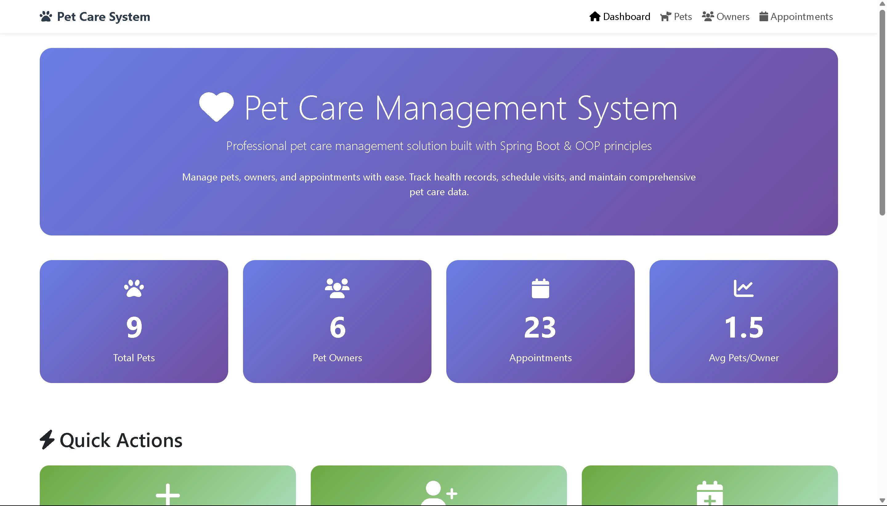

# OOP_N03_Term3_2025_K17_Group10
# Nhóm 10: Hệ thống Chăm sóc Thú cưng

## Giới thiệu

Chào mừng đến với **Hệ thống Chăm sóc Thú cưng**, một giải pháp tất cả trong một để quản lý mọi khía cạnh cuộc sống của thú cưng của bạn. Nền tảng sáng tạo này tích hợp các tính năng thiết yếu như hồ sơ thú cưng chi tiết, theo dõi sức khỏe và lịch hẹn, nhắc nhở thuốc men và một cộng đồng sôi động dành cho những người yêu thú cưng. Khám phá một cách thông minh hơn, đơn giản hơn để chăm sóc những người bạn động vật quý giá của bạn.

### Các tính năng chính:
- **Hồ sơ thú cưng chi tiết**: Quản lý thông tin của thú cưng như giống loài, tuổi tác, tình trạng sức khỏe.
- **Theo dõi sức khỏe và lịch hẹn**: Cập nhật tình trạng sức khỏe của thú cưng và theo dõi các lịch hẹn khám bệnh, tiêm phòng.
- **Quản lý chủ của thú cưng**
---

## Thành viên nhóm

- **Nguyễn Mai Anh** | ID: 23010490
- **Nguyễn Dương Ngọc Ánh** | ID: 23011500
- **Đỗ Khắc Huy** | ID: 23010020

---

## Các đối tượng trong hệ thống

1. **Thú cưng (Pet)**
   - Lưu trữ thông tin của thú cưng, bao gồm tên, giống loài, tuổi tác, và tình trạng sức khỏe.
   
   **Thuộc tính**:
   - ID (Mã thú cưng)
   - Name (Tên thú cưng)
   - Type (Giống loài)
   - Age (Tuổi)
   - HealthStatus (Tình trạng sức khỏe)
   - OwnerID (Mã khách hàng)

2. **Chủ Pet (Owner)**
   - Lưu trữ thông tin của khách hàng sở hữu thú cưng.
   
   **Thuộc tính**:
   - ID (Mã khách hàng)
   - Name (Tên khách hàng)
   - Address (Địa chỉ)
   - Phone (Số điện thoại)
   - Email (Email)

3. **Dịch vụ (Service)**
   - Cung cấp các dịch vụ chăm sóc thú cưng như tiêm phòng, cắt tỉa lông, khám sức khỏe.

   **Thuộc tính**:
   - ServiceID (Mã dịch vụ)
   - Name (Tên dịch vụ)
   - Description (Mô tả dịch vụ)
   - Price (Giá dịch vụ)

4. **Lịch hẹn (Appointment)**
   - Quản lý các cuộc hẹn giữa khách hàng và dịch vụ chăm sóc thú cưng.

   **Thuộc tính**:
   - AppointmentID (Mã lịch hẹn)
   - PetID (Mã thú cưng)
   - ServiceID (Mã dịch vụ)
   - Date (Ngày hẹn)
   - Time (Giờ hẹn)

5. **Hồ sơ bệnh án (MedicalRecord)**
   - Lưu trữ các thông tin y tế của thú cưng, bao gồm lịch sử bệnh tật, phương pháp điều trị, và vắc xin đã tiêm.

   **Thuộc tính**:
   - RecordID (Mã hồ sơ)
   - PetID (Mã thú cưng)
   - Date (Ngày khám)
   - Diagnosis (Chẩn đoán)
   - Treatment (Phương pháp điều trị)
   - VaccineHistory (Lịch sử tiêm chủng)

6. **Sản phẩm (Product)**
   - Quản lý các sản phẩm dành cho thú cưng như thức ăn, đồ chơi, thuốc men.

   **Thuộc tính**:
   - ProductID (Mã sản phẩm)
   - Name (Tên sản phẩm)
   - Category (Loại sản phẩm)
   - Price (Giá sản phẩm)
   - Stock (Tồn kho)

7. **Đơn hàng (Order)**
   - Quản lý các đơn hàng của khách hàng, bao gồm sản phẩm đã đặt và trạng thái đơn hàng.

   **Thuộc tính**:
   - OrderID (Mã đơn hàng)
   - OwnerID (Mã khách hàng)
   - ProductList (Danh sách sản phẩm)
   - TotalPrice (Tổng giá trị)
   - OrderStatus (Trạng thái đơn hàng)

8. **Nhân viên (Staff)**
   - Lưu trữ thông tin về nhân viên của hệ thống.

   **Thuộc tính**:
   - StaffID (Mã nhân viên)
   - Name (Tên nhân viên)
   - Role (Vai trò)
   - ContactInfo (Thông tin liên lạc)

---

## Cấu trúc hệ thống và mối quan hệ giữa các đối tượng

- **Chủ Pet (Owner)** có thể sở hữu một hoặc nhiều **Thú cưng (Pet)**.
- **Thú cưng (Pet)** có thể có nhiều **Lịch hẹn (Appointment)** và một **Hồ sơ bệnh án (MedicalRecord)**.
- **Lịch hẹn (Appointment)** liên kết với **Dịch vụ (Service)** và **Thú cưng (Pet)**.
- **Chủ Pet (Owner)** có thể đặt nhiều **Đơn hàng (Order)**, mỗi **Đơn hàng (Order)** có thể bao gồm nhiều **Sản phẩm (Product)**.
- **Nhân viên (Staff)** cung cấp **Dịch vụ (Service)** cho **Thú cưng (Pet)** trong **Lịch hẹn (Appointment)**.

  
## CLASS DIAGRAMS

## Sequence Diagrams
#ADD

#DELETE

#EDIT

## Lưu đồ thuật toán phương thức: DisplayPetDetails

Bắt đầu

Kiểm tra: pets == null || pets.isEmpty()

Nếu đúng → In "Danh sách thú cưng trống. Không có gì để hiển thị." → Kết thúc

Nếu sai → In tiêu đề bảng

Duyệt for (Pet pet : pets):

In: ID, Tên, Loại, Tuổi của mỗi thú cưng

In tổng số thú cưng

Kết thúc

## Giao diện: 

## Hướng dẫn cài đặt và chạy chương trình
###	Cài đặt môi trường:
•	Cài đặt JDK (Java Development Kit).
•	Cài đặt IDE hỗ trợ Java SpringBoot .
•	Cài đặt thư viện nếu chưa có sẵn.
###	Clone repository từ   https://github.com/duonganh16/OOP_N03_Term3_2025_K17_Group10/tree/master
###	Chạy chương trình:
      Import project vào IDE và cấu hình Java SpringBoot. Chạy để khởi động ứng dụng.

## Giao diện ứng dụng

## Tầm nhìn phát triển
- **Cộng đồng yêu thích thú cưng**: Giao lưu thú cưng.
- **Báo mal điện tử về cho chủ tình trạng các bé**
- **Chia nhóm thú cưng** 
...
